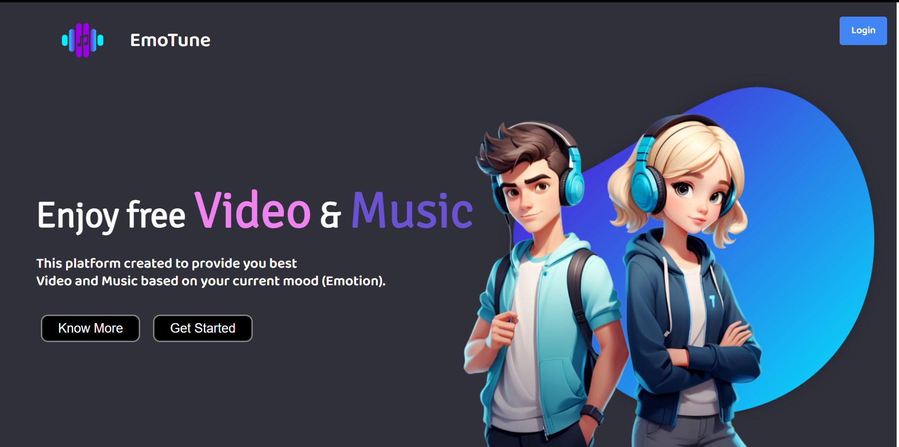
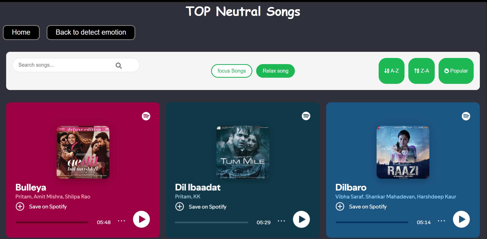

<div align="center">
  <h1>🎵 EmoTune</h1>
  <p>
    <strong>Mood-Based Music & Video Recommendation Platform</strong><br/>EmoTune is a Flask-based AI web application that detects your facial emotion in real-time and recommends Spotify music and YouTube videos based on your mood.
Built using Python, TensorFlow, OpenCV, Spotify API, YouTube API, and interactive front-end templates.
  </p>

[](https://www.python.org/)
[](https://flask.palletsprojects.com/)
[](https://www.tensorflow.org/)
[](https://opencv.org/)
[](https://developer.spotify.com/)
[](https://console.cloud.google.com/)
[](https://cloud.google.com/)
[](https://developer.mozilla.org/)
[](https://developer.mozilla.org/)
[](https://developer.mozilla.org/)
[](https://vercel.com/)


</div>

---

## Live Demo  
[emotune.vercel.app](https://intervuai.vercel.app) *(Coming Soon)*

---

## 🚀 Features

### 🔍 1. Real-Time Emotion Detection

- Uses FER (fer.h5 model)

- Powered by OpenCV + Haarcascade face detection

- Detects moods like: Happy, Sad, Angry, Neutral, Surprise, Fear

### 🎧 2. Spotify Music Recommendation

- Suggests playlists/songs from Spotify based on detected emotion

- Integration via Spotify API OAuth

- Automatic token refreshing using your callback_server.py

### 🎬 3. YouTube Video Recommendation

- Uses YouTube Data API

- Returns emotion-based videos, motivational clips, or relaxing content

### 🌐 4. Flask Web App

- User-friendly UI

- Static + template folder structure

- Routes for camera, predictions, and recommendations

### 🔐 5. Secure API Handling

- Credentials stored in .env and client_secret.json

- Refresh tokens via refresh.py

- No secrets exposed
---

## Tech Stack


### Backend

- Flask

- TensorFlow / Keras

- OpenCV

- Spotipy (Spotify API)

- Google API Client (YouTube)

### Frontend

- HTML5

- CSS3

- JavaScript

---

# 🔧 Installation & Setup
### 1. Clone the project
```
git clone https://github.com/yourusername/EmoTune.git
cd EmoTune
```

### 2. Create & activate virtual environment
```
python -m venv venv
venv\Scripts\activate   # Windows
```

### 3. Install dependencies
```
pip install -r requirement.txt
```

### 4. Add API credentials
```
Create .env
SPOTIFY_CLIENT_ID=your_id
SPOTIFY_CLIENT_SECRET=your_secret
SPOTIFY_REDIRECT_URI=http://127.0.0.1:5000/callback
YOUTUBE_API_KEY=your_youtube_key
```

#### Add Spotify JSON:

client_secrets.json example:
```
{
  "client_id": "your_id",
  "client_secret": "your_secret"
}
```
### ▶️ Run the App
#### Step 1 — Generate Spotify Tokens
```
python get_tokens.py
```

#### Step 2 — Start Flask Server
```
python app.py
```


Visit:
```
http://127.0.0.1:5000
```
---
---

# Project Structure
```
EmoTune/
├── static/                         → CSS, JS, images
├── templates/                      → HTML (Jinja) pages
├── __pycache__/                    
├── .env                            → Environment variables
├── app.py                          → Main Flask server
├── callback_server.py              → Spotify callback OAuth handler
├── client_secrets.json             → Spotify client keys
├── fer.h5                          → Emotion detection ML model
├── get_tokens.py                   → Spotify token generator
├── haarcascade_frontalface_default.xml → Face detection model
├── README.md                       → Documentation
├── refresh.py                      → Token refresh logic
├── requirement.txt                 → List of dependencies
└── secret.py                       → API key loader (if any)

```

---

# Steps to get keys + dataset and file descriptions for EmoTune

## 1) Download FER2013 (Kaggle)

### Option A — Web

- Open: https://www.kaggle.com/datasets/msambare/fer2013

- Sign in to Kaggle, click Download and save the ZIP.

- Unzip and place fer2013.csv into your project directory (e.g. data/fer2013.csv).

### Option B — Kaggle CLI (recommended for scripts)

- Install kaggle CLI and configure (create API token from your Kaggle account → place kaggle.json in ~/.kaggle/).

From project root:
```
kaggle datasets download -d msambare/fer2013 -p data/
unzip data/fer2013.zip -d data/
```

Note: fer2013.csv contains pixel values and emotion labels. If you already have a pre-trained fer.h5, you can skip training and use that file (place fer.h5 in project root).

---

## 2) Create Spotify Developer App + redirect URL

- Open: https://developer.spotify.com/ → Dashboard → Log in.

- Create New App (give a name like EmoTuneDev).

- In the app settings, set Redirect URIs to:
```
http://localhost:8888/callback
```

- Copy Client ID and Client Secret — store them securely (see client_secrets.json or .env below).

**Important**: make sure port and path match what your oauth code expects (/callback on port 8888 in your case).

## 3) Create Google Cloud API key (for YouTube)

- Open: https://console.cloud.google.com/ → Select or create a Project.

- Go to APIs & Services → Credentials → Create Credentials → API key.

- Copy the generated API key and store it in your .env as YOUTUBE_API_KEY (or in secret.py).
---
# File descriptions + example implementations

Below are clear descriptions plus example code / JSON for each file you asked about. Adapt paths and variable names to your repo.

## callback_server.py

Purpose: A small web server route that handles the OAuth redirect from Spotify (receives code and exchanges it for tokens).
Where used: Spotify OAuth flow — when user authorizes the app they are redirected to your redirect_uri and this file handles the callback.

---

## client_secrets.json

Purpose: Store Spotify client ID & client secret locally in a JSON file (alternative to .env). Do NOT commit to git.

---

## get_tokens.py

Purpose: Launch the authorization URL to start Spotify OAuth (or programmatically request tokens). This script usually builds the Spotify authorization URL (scope, client_id, redirect_uri) and opens it in the browser. After user authorizes, Spotify redirects to callback_server.py which exchanges the code.

---

## refresh.py

Purpose: Refresh Spotify access tokens when they expire using the refresh_token. Spotify access tokens expire (usually 1 hour); refresh_token is exchanged for new access_token.

---

## tempCodeRunnerFile.py

Purpose: Often an auto-generated file by code editors (e.g., VS Code) used to run a quick snippet. In project context, this might be a throwaway runner or a script you used to test a function (e.g., testing emotion detection pipeline). Keep it local or remove it — it’s not required in production.

---

## Additional tips & environment variables

Add to .env :
```
SPOTIFY_CLIENT_ID=pk_your_id
SPOTIFY_CLIENT_SECRET=sk_your_secret
```

# Quick checklist to finish setup

 - Download fer2013.csv (or fer.h5) and place in project data/ or root.

 - Run callback_server.py and get_tokens.py to obtain spotify_tokens.json.

 - Save YouTube API key in .env or client_secrets.json.

 - Implement periodic token refresh with refresh.py when building production flow.

 - Replace any tempCodeRunnerFile.py test code with proper scripts or delete it.

---

# 🧠 How It Works

- User clicks Start Emotion Detection

- Camera opens → model predicts emotion

- Emotion passed to Spotify + YouTube APIs

- System returns:🎶 Playlist (Spotify) & 🎥 Videos (YouTube)

- UI updates recommendations instantly

---
# 😂 Supported Emotions

| Emotion  | Output songs         |
|----------|-----------------------|
| Happy    | Love & Happy vibes      |
| Sad      | Melancholic & Comfort    |
| Angry    | Aggressive & venting             |
| Neutral  | Relax & Focus   |
| Surprise | Upbeat and Chill        |
| Fear | Calm & Brave        |


---

#🏗️ Future Enhancements

- Add user login & history tracking

- Personalized recommendations

- Multi-model emotion fusion

- Save to Spotify playlists

- Dark mode UI

 ---


# Screenshots

#### Dashboard <br/>
#### Music Rcommendation <br/>


---

# Author
### Upendra Dhawalkar 
B.Tech @ BIT Durg <br />
Web Developer | Data Analyst <br />
Full-Stack | AI Enthusiast <br />
<!--  -->
[](https://www.linkedin.com/in/upendradhawalkar//)
---

# License
MIT License – Free to use, modify, and distribute.
